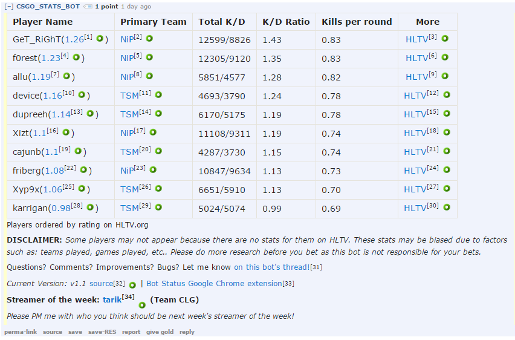

#CS:GO Stats Bot
Created by [/u/CSGO_STATS_BOT](https://www.reddit.com/user/CSGO_STATS_BOT) for [/r/csgobetting](https://www.reddit.com/r/csgobetting).

#Note
Due to the bot's [retirement](https://www.reddit.com/r/csgobetting/comments/2yxp2w/the_end_of_csgo_stats_bot/), the source code was published for all to use. I'm uploading this up with permission from OP so that the community can contribute and make this a better bot for the subreddit.

#Requirement
- A server (like a Raspberry Pi)
- Reddit account

#Sample
ESL One Katowice 2015 - Ninjas in Pajamas vs. Team SoloMid [[link](https://www.reddit.com/r/csgobetting/comments/2yurh3/nip_vs_tsm_bo3_130315_1300_cet/cpd4jp5)]

